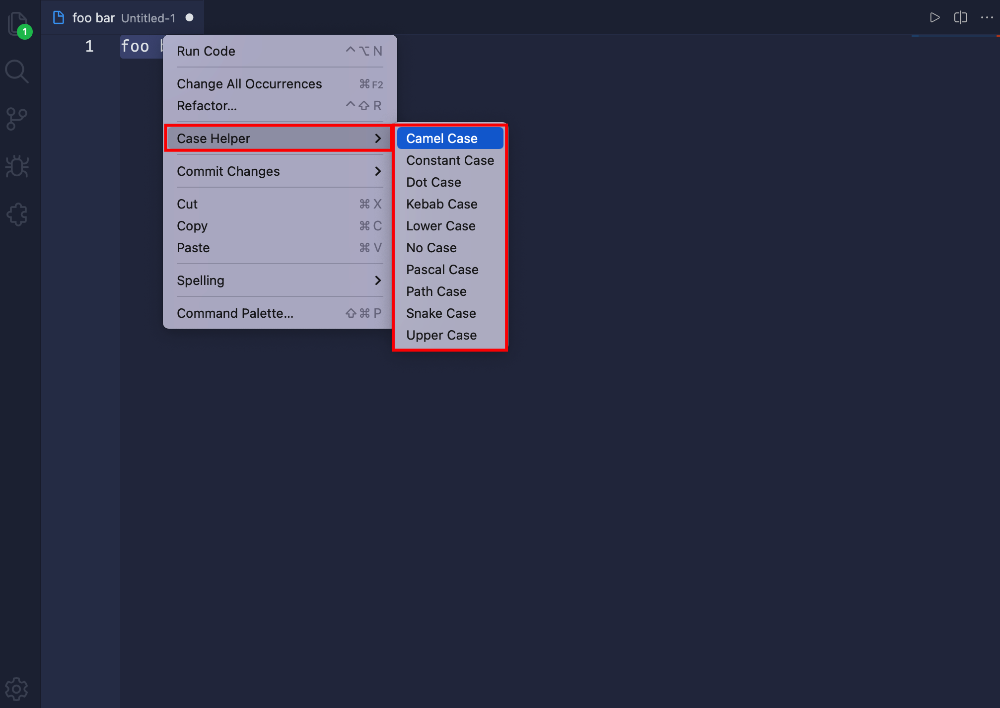

# VSCode Case Helper

Helper to easily change case for the Visual Studio Code editor. 🚀


## Install 📦

Open Visual Studio Code, press Ctrl/Cmd+P.

Paste the following command, and press Enter:

```
ext install case-helper
```

## Usage 🪄

- 1. Select the text in the VSCode editor
- 2. Right-click and select the format to be changed through the Case Helper menu



## All Format Examples 🎨

| Format        | Example   |
| ------------- | --------- |
| Camel Case    | `fooBar`  |
| Constant Case | `FOO_BAR` |
| Dot Case      | `foo.bar` |
| Kebab Case    | `foo-bar` |
| Lower Case    | `foobar`  |
| No Case       | `foo bar` |
| Pascal Case   | `FooBar`  |
| Path Case     | `foo/bar` |
| Snake Case    | `foo_bar` |
| Upper Case    | `FooBar`  |
